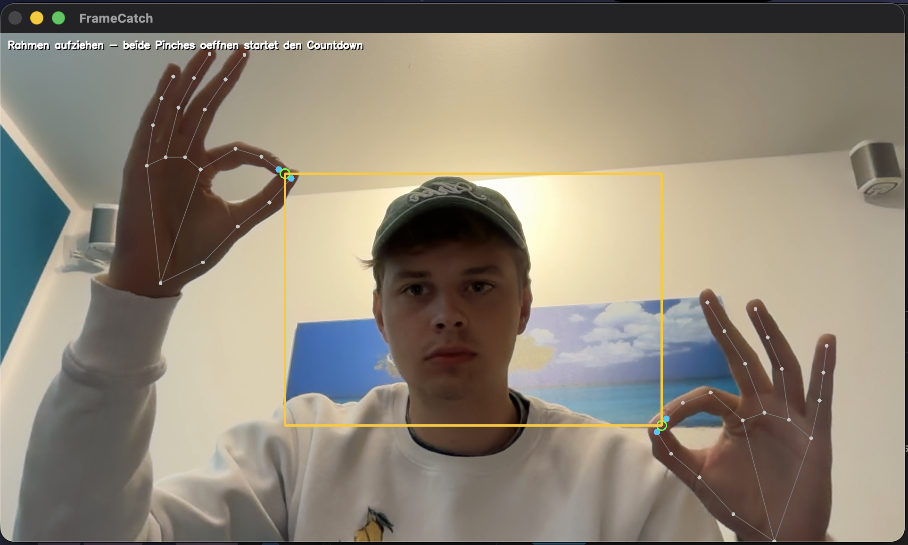

# FrameCatch

Gesten-gesteuerte Webcam-Fotos für den Mac: Mit beiden Händen einen Rahmen
„aufziehen", loslassen – und nach einem 3-Sekunden-Countdown wird der
Ausschnitt als Foto gespeichert.



## Funktionsweise

1. **Rahmen aufziehen:** Mit beiden Händen gleichzeitig eine Pinch-Geste
   machen (Daumen- und Zeigefingerspitze zusammen). Die beiden Pinch-Punkte
   spannen ein Rechteck auf, das live eingezeichnet wird.
2. **Auslösen:** Beide Pinches öffnen. Das Rechteck friert ein, ein sichtbarer
   3-Sekunden-Countdown läuft (mit Tick-Sound pro Sekunde).
3. **Foto:** Der Rechteck-Ausschnitt wird als JPG in `fotos/` gespeichert
   (`foto_JJJJMMTT_HHMMSS.jpg`), begleitet von Blitz-Effekt, Auslöse-Sound und
   einer kurzen Vorschau oben rechts.

Rechtecke kleiner als 80×80 px werden ignoriert (zurück zum Start).
Beenden mit Taste **`q`**.

## Voraussetzungen

- macOS mit eingebauter oder angeschlossener Webcam
- **Python 3.12** (MediaPipe unterstützt aktuell kein Python 3.13)

## Setup

```bash
cd FrameCatch
python3.12 -m venv .venv
source .venv/bin/activate
pip install -r requirements.txt
```

### macOS-Kameraberechtigung

Beim ersten Start fragt macOS nach Kamerazugriff. Falls das Bild schwarz
bleibt oder die App mit einer Fehlermeldung abbricht:

**Systemeinstellungen → Datenschutz & Sicherheit → Kamera** öffnen und dort
das Terminal (bzw. die IDE, aus der die App gestartet wird) erlauben.
Danach das Terminal neu starten.

## Starten

```bash
python main.py
```

## Tests

Die Gesten-/Zustandslogik (`state_machine.py`) ist bewusst ohne Kamera- und
OpenCV-Abhängigkeit geschrieben und vollständig unit-getestet:

```bash
python -m pytest test_state_machine.py -v
```

## Projektstruktur

```
FrameCatch/
├── main.py                # Einstieg: Kamera-Loop, verbindet alle Module
├── hand_tracker.py        # MediaPipe-Wrapper: Pinch-Status + Pinch-Punkt pro Hand
├── state_machine.py       # Zustände + Übergänge inkl. Entprellung (ohne OpenCV)
├── overlay.py             # Zeichnen: Rechteck, Countdown, Blitz, Vorschau, Status
├── capture.py             # Ausschnitt speichern, Sounds via afplay
├── config.py              # Alle Konstanten (Schwellwerte, Zeiten, Farben, Pfade)
├── test_state_machine.py  # Unit-Tests für die Zustandsmaschine (pytest)
├── requirements.txt
└── README.md
```

## Konfiguration

Alle Stellschrauben liegen in `config.py`, u. a.:

| Konstante            | Bedeutung                                  | Standard |
| -------------------- | ------------------------------------------ | -------- |
| `PINCH_VERHAELTNIS`  | Pinch-Schwelle relativ zur Handgröße       | 0,25     |
| `PINCH_SCHWELLE_MIN_PX` | Untergrenze der Pinch-Schwelle          | 30 px    |
| `PINCH_STABIL_S`     | Stabilzeit Doppel-Pinch → Rahmen-Modus     | 0,3 s    |
| `OEFFNEN_STABIL_S`   | Stabilzeit Loslassen → Countdown           | 0,4 s    |
| `TRACKING_VERLUST_S` | Toleranz bei Tracking-Aussetzern           | 0,5 s    |
| `COUNTDOWN_DAUER_S`  | Countdown-Länge                            | 3 s      |
| `MIN_RECHTECK_PX`    | Mindestgröße des Ausschnitts               | 80 px    |
